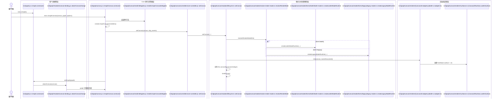
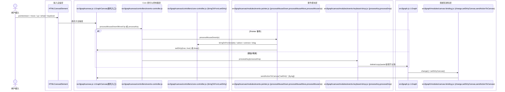

# Core Library Sequence Diagrams

> 范围：仅 `src/**` 核心库调用链，不包含 `editor/**`。

## 1) 初始化与渲染模式解析（用户 -> Canvas -> Adapter）



## 2) 用户交互链（Pointer/Keyboard -> 命中与脏标记）



## 3) 执行与渲染主链（Graph Step -> Frame -> Nodes/Links -> 底层 Context）

```mermaid
sequenceDiagram
    actor User as 用户操作(开始/下一步)
    box 图执行层
        participant Runtime as src/lgraph/modules/runtime-loop.js::{start,runStep}
        participant Graph as src/lgraph.js::LGraph
        participant Binding as src/lgraph/modules/canvas-binding.js::change
    end
    box Core 委托与控制器层
        participant C as src/lgraphcanvas.js::LGraphCanvas(委托入口)
        participant CoreCtl as src/lgraphcanvas/controllers/core-controller.js::startRendering
        participant RenderCtl as src/lgraphcanvas/controllers/render-controller.ts
    end
    box 渲染模块层
        participant Life as src/lgraphcanvas/modules/lifecycle.ts::startRendering
        participant Frame as src/lgraphcanvas/modules/render-frame.ts::{draw,drawBackCanvas,drawFrontCanvas}
        participant Back as src/lgraphcanvas/modules/render-background-groups.js::drawBackCanvas
        participant Nodes as src/lgraphcanvas/modules/render-nodes.ts::{beginNodeFrameLeafer,drawNode,endNodeFrameLeafer}
        participant Links as src/lgraphcanvas/modules/render-links.js::{drawConnections,renderLink}
    end
    box 渲染底层适配层
        participant Adapter as src/lgraphcanvas/renderer/{canvas2d-adapter.js|leafer-ui-adapter.ts}
        participant Ctx as Canvas2D/Leafer Context
    end

    User->>Runtime: graph.start() / graph.runStep()
    Runtime->>Graph: node.doExecute()
    Graph->>Binding: change()
    Binding->>C: setDirty(true, true)
    C->>CoreCtl: startRendering()
    CoreCtl->>Life: requestAnimationFrame 循环
    Life->>RenderCtl: draw()
    RenderCtl->>Frame: draw(force_canvas, force_bgcanvas)
    Frame->>Back: drawBackCanvas()
    Frame->>Adapter: beginFrame("front")
    Frame->>Frame: computeVisibleNodes()
    alt Leafer 节点帧启用
        Frame->>Nodes: beginNodeFrameLeafer(ctx, visibleNodes)
        loop 每个可见节点
            Frame->>Nodes: drawNode(node, ctx)
        end
        Frame->>Nodes: endNodeFrameLeafer(ctx, visibleNodes)
    else Legacy 节点路径
        loop 每个可见节点
            Frame->>Ctx: save + translate(node.pos)
            Frame->>Nodes: drawNode(node, ctx)
            Frame->>Ctx: restore
        end
    end
    Frame->>Links: drawConnections(ctx) / renderLink(...)
    Frame->>Adapter: syncLayer("front") + endFrame("front")
    Adapter->>Ctx: drawImage / blitBackToFront / 原生刷新
```
